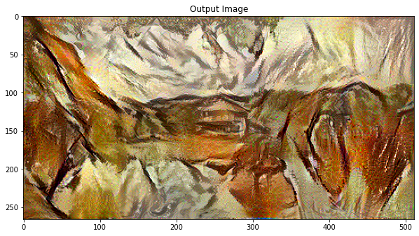

<h1 align="center">Neural Style Transfer</h1>

 

## Introduction
Neural style transfer is an optimization technique used to take three images, a content image, a style reference image (such as an artwork by a famous painter), and the input image you want to style — and blend them together such that the input image is transformed to look like the content image, but “painted” in the style of the style image

## How to Use
1. Clone the repository 
2. In the same directory save the content and style images of interest 
3. Correspondingly change style_pic and content_pic in the notebook

## Example
### Input
|**Content Image**|**Style Image**|
|:--:|:--:|
|||

### Output
|**10 epochs**|**1000 epochs**|
|:--:|:--:|
|||

## Resources
[\[1\] A Neural Algorithm of Artistic Style](https://arxiv.org/abs/1508.06576) 

[\[2\] Tensorflow Tutorial on Neural Style Transfer](https://medium.com/tensorflow/neural-style-transfer-creating-art-with-deep-learning-using-tf-keras-and-eager-execution-7d541ac31398)
